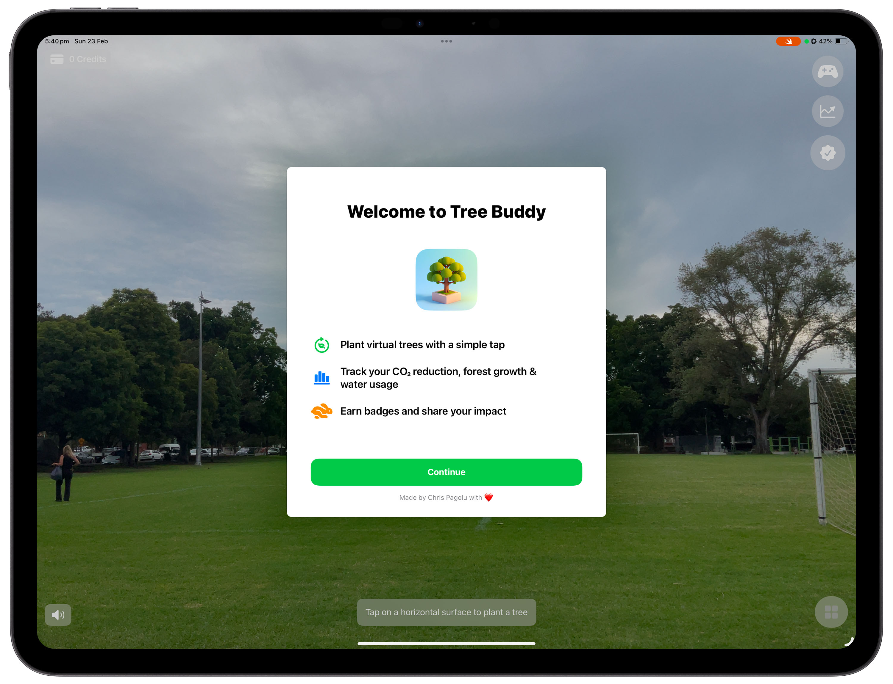
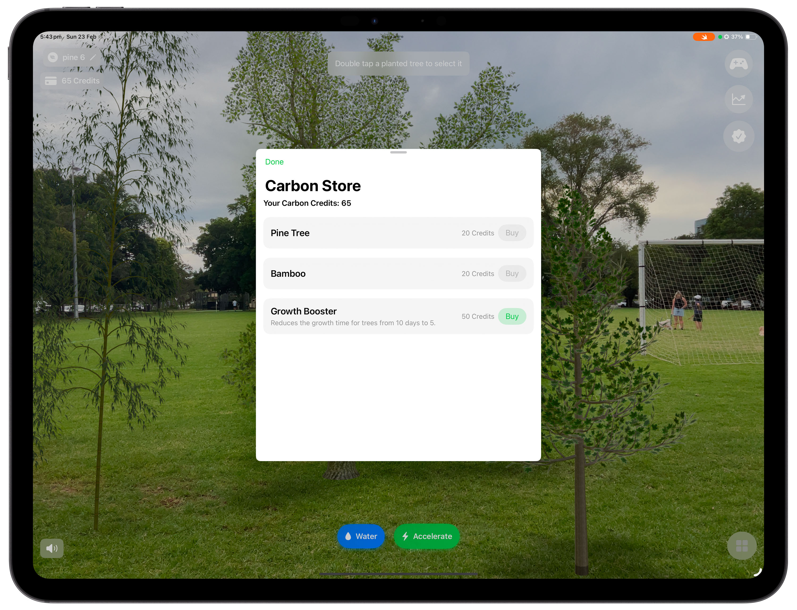

# Tree Buddy 🌳 - Swift Student Challenge 2025 Distinguished Winner

**Tree Buddy is an immersive AR experience where you plant and nurture virtual trees, track your CO₂ reduction and forest growth, and earn rewards—making eco-consciousness fun while inspiring sustainable choices in the real world.**

This project was created for the Apple Swift Student Challenge 2025 and was selected as a **Distinguished Winner**.

---

## Overview

Step into a playful yet impactful augmented reality world with Tree Buddy. Plant digital trees effortlessly on any horizontal surface, watch your virtual forest evolve in real-time, and track the positive environmental impact of your actions. Nurture your digital forest, earn Carbon Credits, unlock badges, and compete on leaderboards, all while being inspired to make a tangible difference in the real world.

## Screenshots

| Welcome Screen                                     | Carbon Store & AR View                             |
| :------------------------------------------------- | :------------------------------------------------- |
|    |  |
| *Initial onboarding with key features.*            | *Interacting with the store and planted trees.*    |

## Key Features

*   **AR Tree Planting:** Seamlessly plant various tree models onto real-world surfaces using ARKit.
*   **Growth Simulation:** Nurture trees by watering them and watch them grow over time. Use "Growth Boosters" to accelerate the process.
*   **Environmental Impact Tracking:** Monitor key metrics like CO₂ reduction, total forest size, and water usage via interactive charts.
*   **Carbon Credits & Store:** Earn credits passively from your trees and spend them in the Carbon Store on new tree types or boosters.
*   **Badges & Achievements:** Unlock unique badges for reaching milestones (e.g., planting your first tree, reaching a certain CO₂ reduction). Share your achievements!
*   **Leaderboards (GameKit):** Compare your environmental impact stats with friends and the global community (Note: Full Game Center integration requires deployment beyond Swift Playgrounds).
*   **Contextual Tips (TipKit):** Receive helpful, non-intrusive guidance throughout the app.
*   **Immersive Audio (AVFoundation):** Enjoy ambient nature sounds and satisfying sound effects for interactions.
*   **Modern UI (SwiftUI):** A clean, intuitive interface inspired by visionOS aesthetics, built entirely with SwiftUI.
*   **LiDAR Integration:** Utilizes LiDAR on supported devices for enhanced occlusion and scene understanding.

## Technology Stack

Tree Buddy leverages a suite of modern Apple frameworks:

*   **SwiftUI:** For the entire user interface, ensuring a declarative, responsive, and modern look and feel.
*   **ARKit:** For world tracking, plane detection, and anchoring virtual content to the real world.
*   **RealityKit:** For rendering high-fidelity 3D models, handling lighting, and managing AR entity interactions. Supports 4K HDR on devices that support it (e.g., iPad Pro).
*   **Combine:** For managing asynchronous events, timers (tree growth, credit generation), and state updates.
*   **TipKit:** For providing contextual onboarding hints and feature discovery.
*   **GameKit:** For integrating Game Center leaderboards and achievements.
*   **AVFoundation:** For managing audio playback (ambient sounds and sound effects).
*   **Charts:** For visualizing environmental impact data.

## Swift Student Challenge 2025

  

I am incredibly honored that Tree Buddy was selected as a **Distinguished Winner** in the Apple Swift Student Challenge 2025. This project was built with immense passion and a genuine desire to blend technology with sustainability in a fun and engaging way.

## Getting Started

1.  Clone this repository: `git clone https://github.com/AllStars101-sudo/Tree-Buddy.git`
2.  Open the `Tree Buddy.swiftpm` file in Swift Playgrounds (Requires Swift Playgrounds 4.5+).
3.  Ensure you have an iPadOS device running iOS 16.0+ (AR features require a physical device with a camera, macOS Catalyst will likely **not**  work).
4.  Build and run the app on your device using the Swift Playgrounds app on iPad.

*Note: Some features like full Game Center authentication might require additional setup or provisioning profiles.*

## Attribution

*   The **Bamboo** 3D model asset used in this project is sourced from Poly by Google (now discontinued archive) and is licensed under [CC BY 4.0](https://creativecommons.org/licenses/by/4.0/). Proper attribution is included within the project comments where the asset is loaded.
*   Other 3D assets were created or sourced appropriately.

## License

This project is licensed under the MIT License - see the [LICENSE](LICENSE) file for details.

## Acknowledgements

*   Thank you to Apple for the opportunity to participate in the Swift Student Challenge.
*   Thanks to the creators of the open-source assets used.

---

Made with ❤️ by Chris Pagolu.